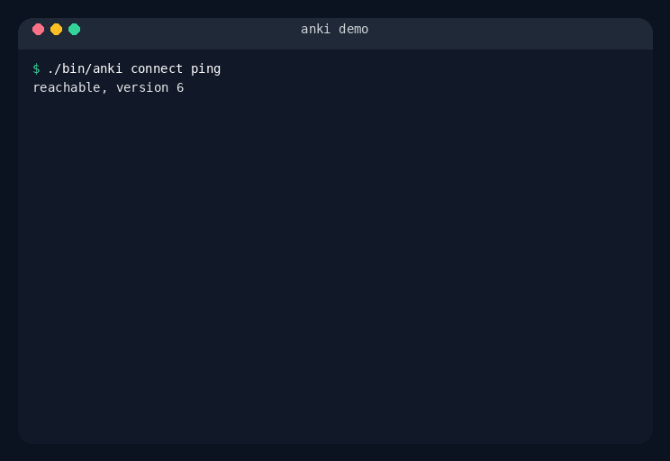

# anki

Small shell-first commands for working with Anki resources through AnkiConnect.



_Regenerate with `./scripts/render-demo.sh`. For future demos, prefer VHS over Terminalizer if you want a cleaner dedicated workflow._

## Install

```sh
./install.sh
```

If you use a custom install path:

```sh
BIN_DIR="$HOME/bin" DATA_DIR="$HOME/.local/share/anki" ./install.sh
export ANKI_DATA_DIR="$HOME/.local/share/anki"
```

## Commands

```sh
anki doctor
anki doctor --fix-wsl
anki version
anki connect ping
anki connect url
anki connect call findNotes '{"query":"deck:Japanese::RTK"}'
anki deck list
anki deck ids
anki deck add "Japanese::MyNewDeck"
anki deck stats "Japanese::RTK"
anki cardtype list
anki cardtype fields list
anki cardtype fields list --cardtype RTK
anki cardtype fields add --cardtype RTK Meaning
anki cardtype templates list
anki card check --deck "Japanese::RTK" --cardtype RTK --field Keyword festival --field Kanji 祭
anki card add --deck "Japanese::RTK" --cardtype RTK --field Keyword festival --field Kanji 祭
```

## Example: create a styled vocabulary card type

This example creates a deck, defines a card type with multiple fields, adds an extra template, and then inserts a card with explicit field values.

```bash
#!/usr/bin/env bash
set -euo pipefail

FRONT_HTML='<div class="expression">{{Expression}}</div>
<div class="reading">{{Reading}}</div>'

BACK_HTML='{{FrontSide}}
<hr id=answer>
<div class="meaning">{{Meaning}}</div>
<div class="example">{{Example}}</div>'

REVERSE_FRONT_HTML='<div class="meaning">{{Meaning}}</div>'

REVERSE_BACK_HTML='{{FrontSide}}
<hr id=answer>
<div class="expression">{{Expression}}</div>
<div class="reading">{{Reading}}</div>
<div class="example">{{Example}}</div>'

CARD_CSS='.card {
  font-family: Arial, sans-serif;
  color: #1f2937;
  background: #f8fafc;
}

.expression {
  font-size: 34px;
  font-weight: 700;
  margin-bottom: 10px;
}

.reading {
  font-size: 22px;
  color: #475569;
}

.meaning {
  font-size: 28px;
  font-weight: 600;
  color: #0f766e;
  margin-bottom: 12px;
}

.example {
  font-size: 20px;
  line-height: 1.5;
}'

anki deck add "Japanese::Vocabulary"

anki cardtype add \
  --cardtype "JapaneseVocab" \
  --field Expression \
  --field Reading \
  --field Meaning \
  --field Example \
  --template-name "Recognition" \
  --front "$FRONT_HTML" \
  --back "$BACK_HTML" \
  --css "$CARD_CSS"

anki cardtype templates add \
  --cardtype "JapaneseVocab" \
  --template "Recall" \
  --front "$REVERSE_FRONT_HTML" \
  --back "$REVERSE_BACK_HTML"

anki card add \
  --deck "Japanese::Vocabulary" \
  --cardtype "JapaneseVocab" \
  --field Expression "祭り" \
  --field Reading "まつり" \
  --field Meaning "festival" \
  --field Example "夏祭りに行きました。"
```

Useful follow-up checks:

```sh
anki deck list
anki cardtype fields list --cardtype "JapaneseVocab"
anki cardtype templates list --cardtype "JapaneseVocab"
```

## Environment

- `ANKI_DATA_DIR`: override where `anki` looks for installed library files
- `ANKI_CONNECT_URL`: override the AnkiConnect endpoint
- `ANKI_CONNECT_API_KEY`: optional AnkiConnect API key

## WSL

If Anki runs on Windows and `anki` runs inside WSL:

```sh
anki doctor
anki doctor --fix-wsl
anki deck list
```

`anki doctor --fix-wsl` updates AnkiConnect's Windows `config.json`, creates a `.bak` backup, and sets `webBindAddress` to `0.0.0.0`.

When `ANKI_CONNECT_URL` is not set, commands running inside WSL will try the default `http://127.0.0.1:8765` first and then automatically retry the suggested Windows host URL.

You can still set `ANKI_CONNECT_URL` explicitly if you want to force a specific endpoint.
